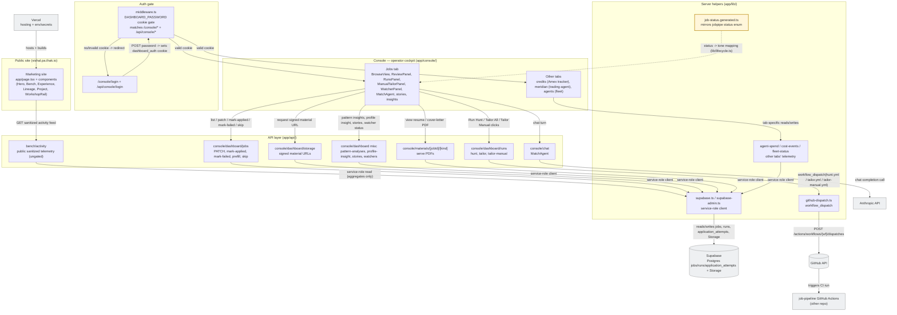
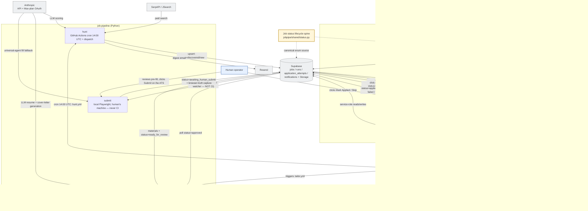

# Architecture

One diagram owned by this repo (the **portfolio** architecture), plus a
reference copy of the **system context** diagram that's canonical in the
`job-pipeline` repo. Both are plain-text Mermaid so they render on GitHub, in
any markdown viewer, and stay easy to update alongside the code. Polished
standalone HTML renders (Mermaid via CDN, light theme) live in
[`docs/diagrams/`](diagrams/): [`portfolio.html`](diagrams/portfolio.html) and
[`system-context.html`](diagrams/system-context.html).

## 1. Portfolio architecture

**Legend:** yellow subgraphs are in-repo areas (public site, auth gate,
console, API layer, server lib helpers); grey boxes are external systems
(Supabase, GitHub, Anthropic, Vercel); the amber box mirrors job-pipeline's
canonical status enum. The console also fronts non-job-pipeline tabs (Amex
credit tracker, trading-agent, fleet) — those are collapsed into single boxes
since their internals aren't load-bearing here.

## 2. System context — job-pipeline ⇄ portfolio

> **This copy is a reference mirror.** The canonical version of this diagram
> lives in `job-pipeline/docs/ARCHITECTURE.md` — update that one first, then
> sync this copy.

**Legend:** yellow subgraphs are each repo's collapsed internals; blue is the
human operator; grey boxes are external systems (Supabase, GitHub Actions,
Anthropic, SerpAPI/JSearch, Resend, Vercel); the amber box is the shared
status-lifecycle contract. **Supabase is the only bus** — job-pipeline and
portfolio never call each other directly, they meet at the database.
**Submit is the one exception to CI**: it runs locally on the human's machine
and is only ever given intent (a status row), never dispatched by GitHub
Actions.

## Keeping this current

These diagrams are hand-maintained, not generated, so they will drift the
moment a route, tab, or external service changes without a matching edit
here. Treat a diagram update as part of the same PR whenever you: add or
remove a console tab or API route under `app/api/console/`; change how
`middleware.ts` gates access; add a new external service dependency; or
change how portfolio and job-pipeline talk to each other (a new
`workflow_dispatch` target, a new Supabase table, or anything that changes
the shared-database contract). The system-context diagram in this file is a
mirror — if job-pipeline's copy changes, pull that update over here too.
When in doubt, regenerate by re-reading this file, `app/api`, `app/console`,
`app/lib`, and `middleware.ts`, then re-validate every Mermaid block with
`npx @mermaid-js/mermaid-cli` (or a headless render of the HTML pages) before
committing — a diagram that doesn't render is worse than no diagram.
